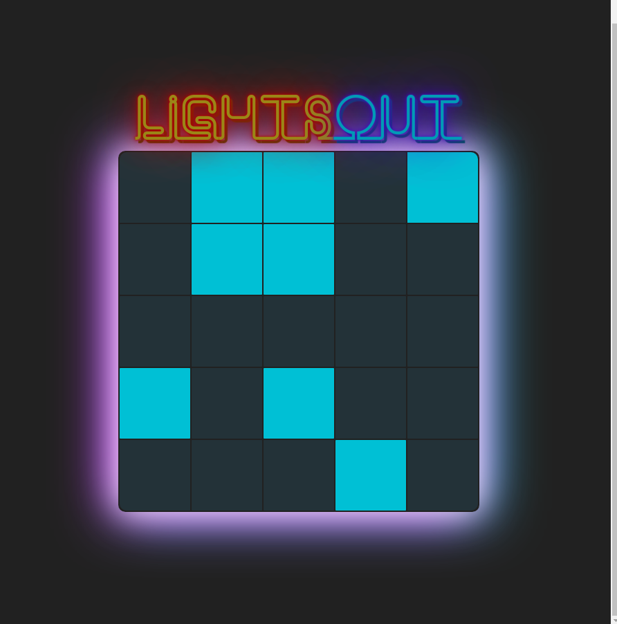
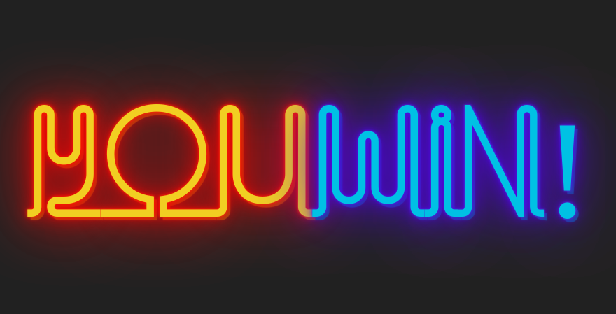

## Lights Out Game

#### This project was created in the process of studying React Events

### Board Component

- Props
  - **nrows:** number of rows in a table
  - **ncols:** number of colomns in a table
  - **chanceLigthStartsOn:** a chance that cell will be lit
- State
  - **hasWon:** true if all cells aren't lit
  - **board:** current board
- Events
  - **none**

### Cell Component

- Props
  - **isLit:** boolean, is this cell lit?
  - **flipCellsAroundMe:** a function rec'd from the board which flips this cell and the cells around of it
- State
  - **none**
- Events
  - **handleClick:** call up to the board to flip cells around this cell

